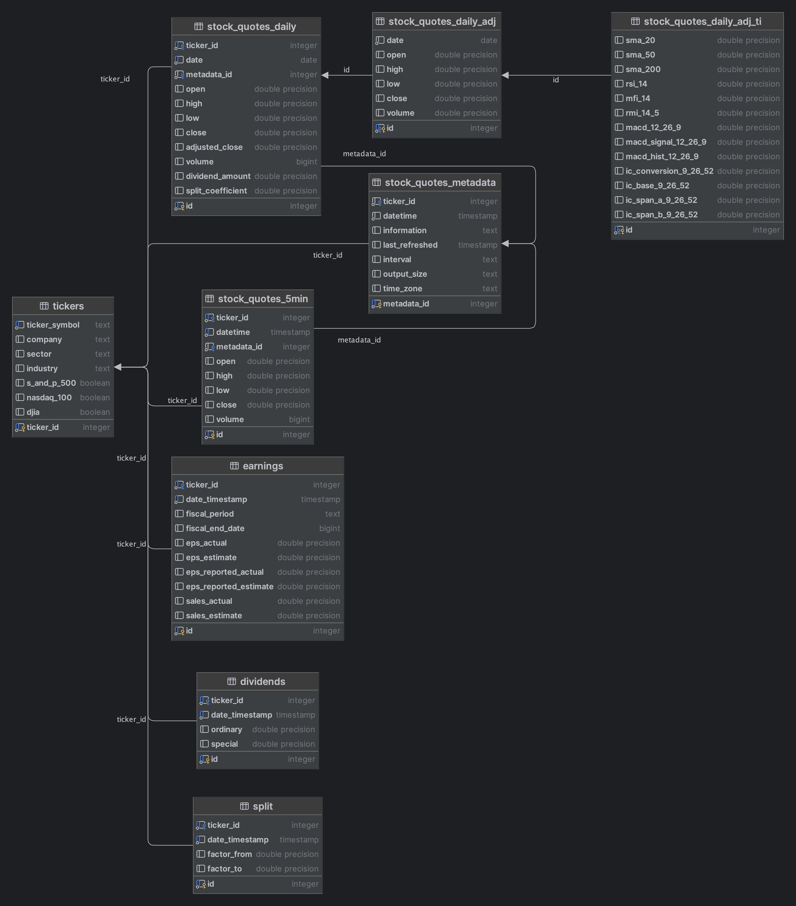

# stock-market-patterns
Researching trading patterns with AI, Machine Learning, and Data Science 

# Initialize PostgreSQL Database
- Install PostgreSQL on local machine:
```bash
 brew install postgresql
 brew services start postgresql@14
 ```
- Create database with user and grant all privileges on database:
```postgresql
CREATE DATABASE your_dbname;
CREATE USER your_username WITH PASSWORD 'your_password';
GRANT ALL PRIVILEGES ON DATABASE your_dbname TO your_username;
\c your_dbname your_admin_user
-- You are now connected to database "your_dbname" as user "your_admin_user".
GRANT ALL ON SCHEMA public TO your_username;
```
- run [get_data.py](src/get_data.py) to create tables and populate database.




# Data gathering
- run [get_ticker_data.py](tools/get_ticker_data.py) to get historical daily candles from Alphavantage API.
- run [scrape_events.py](tools/scrape_events.py) to scrape earnings, dividends, and split dates and info from Finviz.

